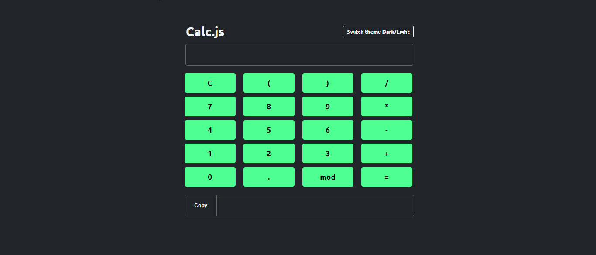

# 🧮 Calc.js

Esse é mais um projeto proposto para praticar os conhecimentos dos módulos de Javascript do curso de Desenvolvimento Full Stack, da One Bit Code. 

 

## 💻 Tecnologias

* HTML5
* CSS3
* JavaScript
* Node

## ➕ Funcionalidades adicionais

* Tema claro/escuro
* Exibir erros 
* Copiar valor do output

## 📚 Aprendizados

* Modularização no Javascript
* Manipulação com a DOM
* Seleção de elementos

Deploy: (clique aqui)[https://dxxiogo.github.io/calc.js/]
